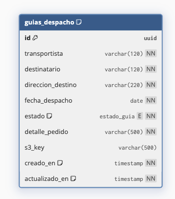

# Gestion de Guias de Despacho

Microservicio Spring Boot para la actividad de Semana 6 de Desarrollo Cloud Native. La aplicacion permite crear, consultar, actualizar y eliminar guias de despacho, ademas de subir y descargar archivos asociados desde Amazon S3. La API esta protegida con JWT emitidos por Azure AD B2C y esta preparada para publicarse detras de AWS API Gateway.

## Caracteristicas

- API REST para gestion de guias de despacho.
- Seguridad stateless con Spring Security OAuth2 Resource Server.
- Autorizacion por roles desde claims de Azure AD B2C.
- Persistencia local con H2 en modo archivo.
- Inicializacion automatica de datos demo.
- Carga, descarga y eliminacion de archivos en Amazon S3.
- Actuator para health checks.
- Dockerfile multi-stage con Java 21.
- Workflow de GitHub Actions para test, build, push a DockerHub y despliegue en EC2.

## Stack tecnico

- Java 21
- Spring Boot 3.5.14
- Spring Web
- Spring Data JPA
- Spring Security
- OAuth2 Resource Server / JWT
- H2 Database
- AWS SDK for Java v2, modulo S3
- Maven
- Docker

## Estructura principal

```text
CloudNativeS6/
|-- Dockerfile
|-- pom.xml
|-- README.md
|-- .env.example
|-- .github/workflows/main.yml
`-- src/
    |-- main/
    |   |-- java/cl/duoc/cloudnative/guias/
    |   |   |-- config/
    |   |   |-- controller/
    |   |   |-- dto/
    |   |   |-- model/
    |   |   |-- repository/
    |   |   |-- security/
    |   |   `-- service/
    |   `-- resources/
    |       |-- application.properties
    |       `-- schema.sql
    `-- test/
```

## Requisitos

- JDK 21.
- Maven 3.9 o superior.
- Docker, si se ejecuta como contenedor.
- Bucket S3 disponible.
- Credenciales AWS con permisos para operar sobre el bucket.
- Tenant y politica de Azure AD B2C configurados para emitir JWT.

## Configuracion

Copia el archivo de ejemplo y completa los valores reales:

```bash
cp .env.example .env
```

Variables principales:

| Variable | Descripcion |
| --- | --- |
| `AZURE_AD_B2C_ISSUER_URI` | Issuer de la politica o user flow de Azure AD B2C. |
| `AZURE_AD_B2C_JWK_SET_URI` | URL del set de llaves publicas para validar JWT. |
| `AWS_REGION` | Region AWS donde esta el bucket S3. Por defecto: `us-east-1`. |
| `AWS_ACCESS_KEY_ID` | Access key para AWS. |
| `AWS_SECRET_ACCESS_KEY` | Secret key para AWS. |
| `AWS_SESSION_TOKEN` | Token temporal, requerido en AWS Academy o credenciales temporales. |
| `S3_BUCKET` | Bucket donde se almacenan los archivos de guias. |
| `SPRING_DATASOURCE_URL` | URL JDBC opcional. Por defecto usa `./data/guias-despacho-db`. |
| `SPRING_DATASOURCE_USERNAME` | Usuario de base de datos. Por defecto: `sa`. |
| `SPRING_DATASOURCE_PASSWORD` | Password de base de datos. Por defecto: vacio. |

> No subas `.env` ni credenciales reales al repositorio.

## Ejecutar local con Maven

Desde la carpeta `CloudNativeS6`:

```bash
mvn spring-boot:run
```

Si quieres cargar variables desde `.env` en una shell local:

```bash
set -a
source .env
set +a
mvn spring-boot:run
```

La aplicacion queda disponible en:

```text
http://localhost:8080
```

Health check:

```bash
curl http://localhost:8080/actuator/health
```

Consola H2:

```text
http://localhost:8080/h2-console
```

Valores por defecto de H2:

```text
JDBC URL: jdbc:h2:file:./data/guias-despacho-db
User: sa
Password:
```

## Ejecutar con Docker

Construir imagen:

```bash
docker build -t gestion-guias-despacho:local .
```

Ejecutar contenedor:

```bash
docker run --rm \
  --name gestion-guias-despacho \
  -p 8080:8080 \
  --env-file .env \
  -v "$(pwd)/data:/app/data" \
  gestion-guias-despacho:local
```

El volumen `./data:/app/data` conserva la base H2 entre ejecuciones.

## Seguridad y roles

La API usa JWT Bearer tokens. Los roles se convierten a authorities de Spring Security con prefijo `ROLE_`.

Roles soportados:

| Rol | Permisos |
| --- | --- |
| `GESTION_GUIAS` | Crear, listar, actualizar, eliminar, subir archivos y descargar guias. |
| `DESCARGA_GUIAS` | Descargar archivos de guias mediante `GET /api/guias/{id}/descargar`. |

Claims compatibles:

- `extension_Role`
- `extension_role`
- `extension_Roles`
- `role`
- `roles`

Ejemplo de claim valido:

```json
{
  "extension_Role": "GESTION_GUIAS"
}
```

Tambien se aceptan arreglos:

```json
{
  "roles": ["GESTION_GUIAS", "DESCARGA_GUIAS"]
}
```

Rutas publicas:

- `GET /actuator/health`
- `GET /actuator/info`
- `/h2-console/**`

## Endpoints

| Metodo | Ruta | Rol requerido | Descripcion |
| --- | --- | --- | --- |
| `POST` | `/api/guias` | `GESTION_GUIAS` | Crea una guia de despacho. |
| `POST` | `/api/guias/{id}/archivo` | `GESTION_GUIAS` | Sube un archivo asociado a una guia. |
| `GET` | `/api/guias/{id}/descargar` | `DESCARGA_GUIAS` o `GESTION_GUIAS` | Descarga el archivo de una guia. |
| `PUT` | `/api/guias/{id}` | `GESTION_GUIAS` | Actualiza una guia existente. |
| `DELETE` | `/api/guias/{id}` | `GESTION_GUIAS` | Elimina una guia y su archivo S3 si existe. |
| `GET` | `/api/guias?transportista=...&fecha=YYYY-MM-DD` | `GESTION_GUIAS` | Consulta guias por transportista y fecha. |

### Crear guia

```bash
curl -X POST http://localhost:8080/api/guias \
  -H "Authorization: Bearer <token>" \
  -H "Content-Type: application/json" \
  -d '{
    "transportista": "Transporte Norte",
    "destinatario": "Cliente Demo",
    "direccionDestino": "Av. Siempre Viva 123",
    "fechaDespacho": "2026-06-27",
    "detallePedido": "Pedido 1001 con 3 bultos"
  }'
```

Respuesta esperada:

```json
{
  "id": "00000000-0000-0000-0000-000000000000",
  "transportista": "Transporte Norte",
  "destinatario": "Cliente Demo",
  "direccionDestino": "Av. Siempre Viva 123",
  "fechaDespacho": "2026-06-27",
  "estado": "CREADA",
  "detallePedido": "Pedido 1001 con 3 bultos",
  "archivoDisponible": false,
  "creadoEn": "2026-06-27T10:00:00Z",
  "actualizadoEn": "2026-06-27T10:00:00Z"
}
```

### Subir archivo a S3

```bash
curl -X POST http://localhost:8080/api/guias/<id>/archivo \
  -H "Authorization: Bearer <token>" \
  -F "archivo=@guia.pdf"
```

El archivo queda almacenado en el bucket configurado por `S3_BUCKET` y la guia guarda la key S3 asociada.

### Descargar archivo

```bash
curl -L http://localhost:8080/api/guias/<id>/descargar \
  -H "Authorization: Bearer <token>" \
  -o guia-descargada.pdf
```

Si la guia no tiene archivo asociado, la API responde `409 Conflict`.

### Consultar guias

```bash
curl "http://localhost:8080/api/guias?transportista=Transporte%20Norte&fecha=2026-06-27" \
  -H "Authorization: Bearer <token>"
```

### Actualizar guia

```bash
curl -X PUT http://localhost:8080/api/guias/<id> \
  -H "Authorization: Bearer <token>" \
  -H "Content-Type: application/json" \
  -d '{
    "transportista": "Transporte Norte",
    "destinatario": "Cliente Demo",
    "direccionDestino": "Av. Siempre Viva 123",
    "fechaDespacho": "2026-06-28",
    "detallePedido": "Pedido 1001 actualizado",
    "estado": "DESPACHADA"
  }'
```

### Eliminar guia

```bash
curl -X DELETE http://localhost:8080/api/guias/<id> \
  -H "Authorization: Bearer <token>"
```

## Validaciones y errores

Campos requeridos para crear una guia:

- `transportista`, maximo 120 caracteres.
- `destinatario`, maximo 120 caracteres.
- `direccionDestino`, maximo 220 caracteres.
- `fechaDespacho`, formato `YYYY-MM-DD`.
- `detallePedido`, maximo 500 caracteres.

Para actualizar tambien se requiere `estado`.

Codigos relevantes:

| Codigo | Caso |
| --- | --- |
| `400 Bad Request` | JSON invalido o validaciones fallidas. |
| `401 Unauthorized` | Token ausente, invalido o expirado. |
| `403 Forbidden` | Token valido sin rol requerido. |
| `404 Not Found` | Guia inexistente. |
| `409 Conflict` | Guia existente sin archivo disponible para descarga. |
| `500 Internal Server Error` | Error de configuracion o comunicacion con servicios externos. |

## Datos demo

Al iniciar, `DataInitializer` crea tres guias si la tabla esta vacia:

- `Transporte Norte`
- `Logistica Sur`
- `Expreso Central`

Las fechas se generan dinamicamente con base en la fecha actual de ejecucion.

## Base de datos

La estructura se crea desde `src/main/resources/schema.sql`.



Tabla principal:

```text
guias_despacho
```

Indice de consulta:

```text
idx_guias_transportista_fecha (transportista, fecha_despacho)
```

La configuracion por defecto usa H2 persistente en:

```text
./data/guias-despacho-db
```

## Pruebas

Ejecutar tests:

```bash
mvn test
```

Compilar paquete:

```bash
mvn clean package
```

El Dockerfile usa:

```bash
mvn -B clean package -DskipTests
```

## CI/CD con GitHub Actions

El workflow `.github/workflows/main.yml` se ejecuta al hacer push a `main` o manualmente con `workflow_dispatch`.

Pasos principales:

1. Checkout del repositorio.
2. Configuracion de Java 21.
3. Ejecucion de `mvn -B test`.
4. Login en DockerHub.
5. Build de imagen Docker.
6. Push de `latest` a DockerHub.
7. Conexion por SSH a EC2.
8. Pull de la imagen, recreacion del contenedor y montaje de volumen para H2.

Secrets requeridos:

| Secret | Uso |
| --- | --- |
| `DOCKERHUB_USERNAME` | Usuario DockerHub. |
| `DOCKERHUB_TOKEN` | Token DockerHub. |
| `EC2_SSH_KEY` | Llave privada para SSH hacia EC2. |
| `USER_SERVER` | Usuario Linux de EC2. |
| `EC2_HOST` | Host o IP publica de EC2. |
| `AWS_ACCESS_KEY_ID` | Credencial AWS para S3. |
| `AWS_SECRET_ACCESS_KEY` | Credencial AWS para S3. |
| `AWS_SESSION_TOKEN` | Token temporal AWS, si aplica. |
| `S3_BUCKET` | Bucket S3 de guias. |
| `AZURE_AD_B2C_ISSUER_URI` | Issuer de Azure AD B2C. |
| `AZURE_AD_B2C_JWK_SET_URI` | JWK Set URI de Azure AD B2C. |

En EC2 el contenedor se publica en el puerto `8080` y persiste la base en:

```text
~/guias-despacho-data
```

## API Gateway

Para exponer la solucion por AWS API Gateway:

1. Crear rutas equivalentes a los endpoints de `/api/guias`.
2. Apuntar la integracion HTTP a la URL publica del backend desplegado en EC2.
3. Usar API Gateway como punto de entrada publico hacia el microservicio.
4. Mantener la validacion de JWT y roles directamente en el backend Spring Boot.

## Solucion de problemas

### La aplicacion no inicia por configuracion JWT

Revisa que estas variables existan y apunten a la misma politica de Azure AD B2C:

```text
AZURE_AD_B2C_ISSUER_URI
AZURE_AD_B2C_JWK_SET_URI
```

### Respuesta `403 Forbidden`

El token es valido, pero no contiene el rol requerido. Revisa los claims `extension_Role`, `roles` o equivalentes.

### Error al subir o descargar desde S3

Verifica:

- Credenciales AWS vigentes.
- Region correcta en `AWS_REGION`.
- Bucket existente en `S3_BUCKET`.
- Permisos `s3:PutObject`, `s3:GetObject` y `s3:DeleteObject`.

### H2 no conserva datos

Si ejecutas con Docker, confirma que estas montando el volumen:

```bash
-v "$(pwd)/data:/app/data"
```
